<div align="center">
  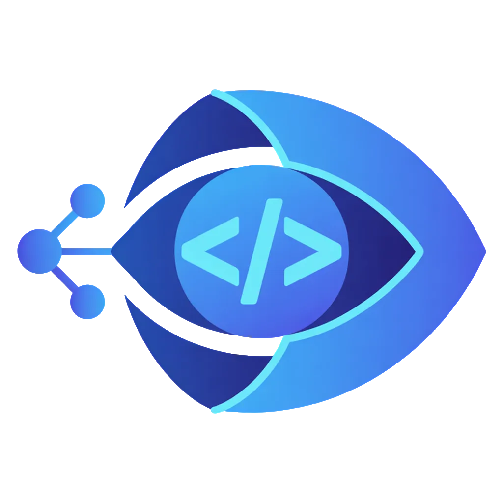
  
  # 🔍 RepoLens
  
  **The ultimate Project Evolution Engine — tracking, scoring, and snapshotting GitHub projects.**
  
  🌐 **Live Site:** [https://repolens07.vercel.app/](https://repolens07.vercel.app/)
  
  [](https://reactjs.org/)
  [](https://nodejs.org/)
  [](https://www.mongodb.com/)
  [](https://tailwindcss.com/)
  
  [Features](#features) •
  [Tech Stack](#tech-stack) •
  [Demo](#demo--screenshots) •
  [Installation](#installation) •
  [Usage](#usage)

</div>

---

## 📖 Overview

**RepoLens** is a powerful application designed to analyze, score, and track the evolution of GitHub repositories over time. Whether you're assessing project health, monitoring contributor activity, or leveraging AI to understand code structure, RepoLens provides deep, real-time insights with a beautiful, responsive user interface.

---

## ✨ Features

- 📊 **Repository Scoring:** Evaluates project health and structure with advanced metrics.
- 🕒 **Project Snapshots:** Tracks changes over time for historical analysis.
- 🤖 **AI-Powered Insights:** Uses OpenAI and onnxruntime for code analysis and embeddings.
- ⚡ **Real-Time Updates:** Powered by Socket.io to keep clients perfectly in sync.
- 🎨 **Beautiful UI:** Crafted with React, Tailwind CSS, Framer Motion for smooth animations, and Recharts for data visualization.
- 🔐 **Secure & Robust:** Employs Firebase Auth, Redis + BullMQ for background jobs, and robust security middleware.

---

## 💻 Tech Stack

### Frontend

- **Framework:** React + Vite
- **Styling:** Tailwind CSS, Framer Motion
- **Data Visualization:** Recharts
- **Communication:** Axios, Socket.io-client
- **Auth:** Firebase

### Backend

- **Core:** Node.js, Express
- **Database:** MongoDB
- **Queue/Cache:** Redis, BullMQ
- **Vector DB:** Qdrant (for AI embeddings)
- **AI/ML:** OpenAI, `@xenova/transformers`, `onnxruntime-node`
- **Real-time:** Socket.io
- **Security:** Helmet, Express-Rate-Limit, Express-Mongo-Sanitize, XSS-Clean

---

## 📂 Project Structure

```text
RepoLens/
├── backend/            # Express API, MongoDB models, background workers
│   ├── src/controllers/
│   ├── src/services/
│   └── src/workers/    # BullMQ job processors for AI & syncing
├── frontend/           # React + Vite application
│   ├── src/components/ # Reusable UI components
│   ├── src/pages/      # Dashboard, Authentication, and Views
│   └── src/api/        # Axios API clients
└── README.md
```

---

## ⚙️ Architecture & Pipeline Workflow

RepoLens utilizes a robust, dual-stage asynchronous pipeline powered by **BullMQ** and **Redis** to ensure scalable and reliable processing of GitHub repositories.

### 1. Project Sync Pipeline (`projectSync.worker`)

When a repository is added or refreshed, the Project Sync worker is triggered:

- **Data Ingestion**: Fetches metadata, commit history, issues, PRs, and contributor stats via the GitHub API (or local path bypass).
- **Health Scoring**: Calculates a repository "health score" based on activity and engagement metrics.
- **Snapshot Creation**: Stores a historical snapshot of the repository state in MongoDB.
- **Alerts & Recommendations**: Generates actionable insights and triggers any configured alerts.
- **Trigger**: Automatically queues the AI Analysis job upon completion.

### 2. AI Analysis & Embedding Pipeline (`aiAnalysis.worker`)

The AI worker performs deep-dive code intelligence using a Retrieval-Augmented Generation (RAG) architecture:

- **Repository Cloning**: Clones the repository locally (depth=1).
- **Repomix Parsing**: Runs Repomix to intelligently parse, chunk, and extract the codebase structure into prioritized files.
- **Vector Embedding**: Embeds the code chunks into **Qdrant** (Vector DB) for lightning-fast semantic search.
- **RAG + LLM Generation**: Uses focused queries against Qdrant to pull relevant context, feeding it to **Gemini/OpenAI** to generate a comprehensive code quality and tech trend report.
- **Real-Time Delivery**: Streams live progress updates back to the frontend via **Socket.io**.

### 🔄 Pipeline Diagram

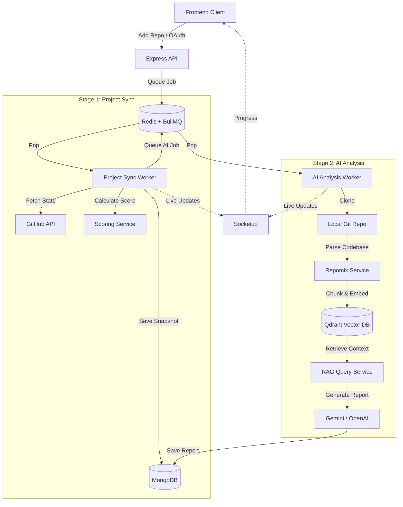

---

## 📸 Demo & Screenshots

### Home & Authentication
| Home Page | Login Page |
| :---: | :---: |
| 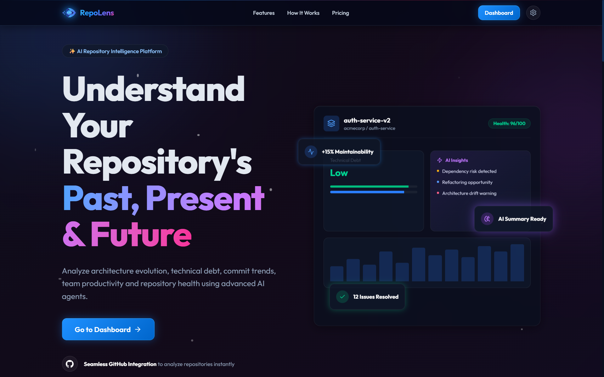 | 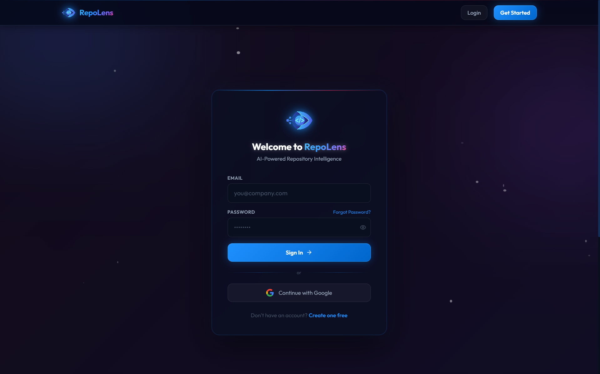 |

| Login with Google | Authenticate by Code |
| :---: | :---: |
| 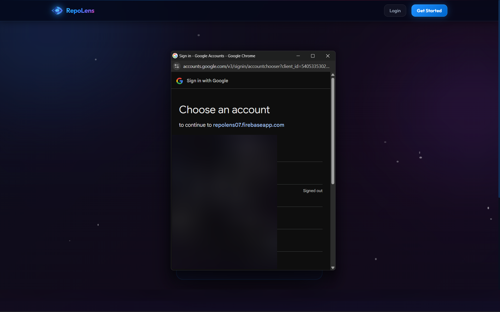 | 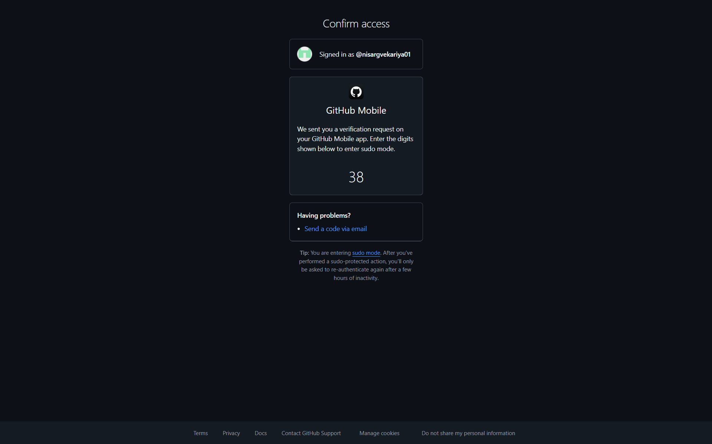 |

### Dashboard & Setup
| Empty Dashboard | Add by URL |
| :---: | :---: |
| 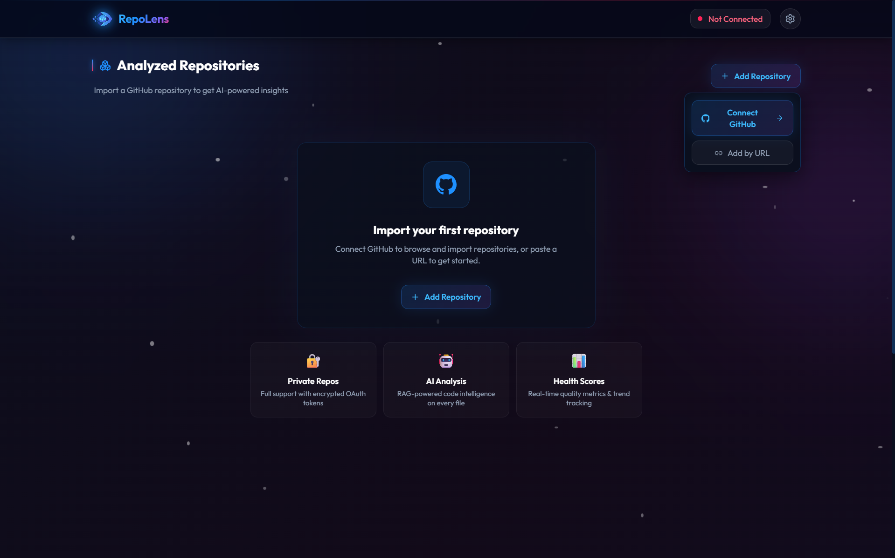 | 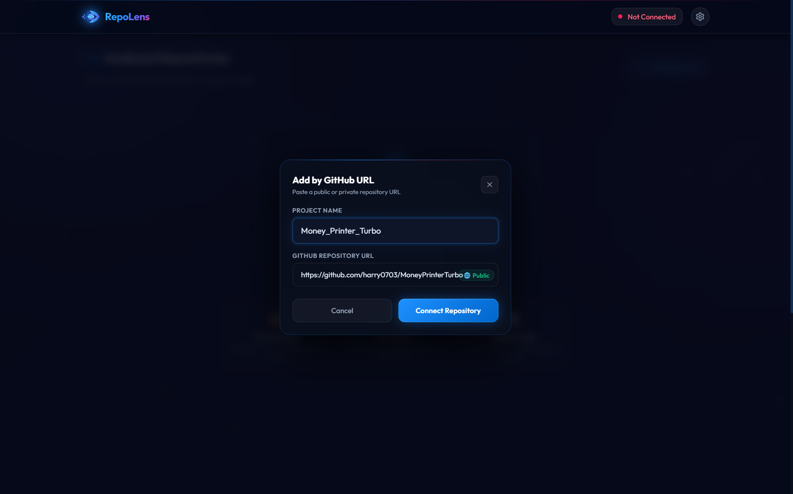 |

| Connect GitHub (Private Repos) | Dashboard with Repository |
| :---: | :---: |
| 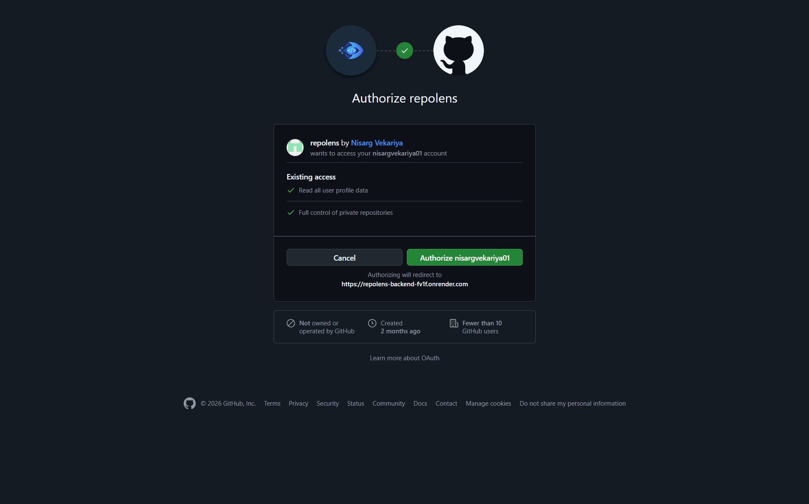 | 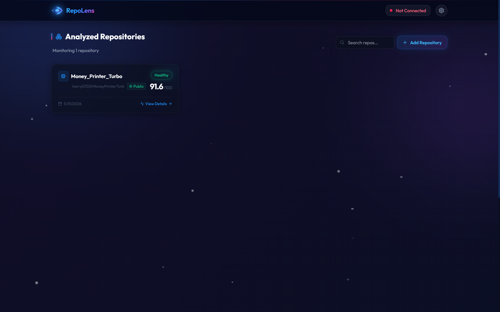 |

### Repository Analysis & Settings
| Initial Setup / Sync | Loading Analysis |
| :---: | :---: |
| 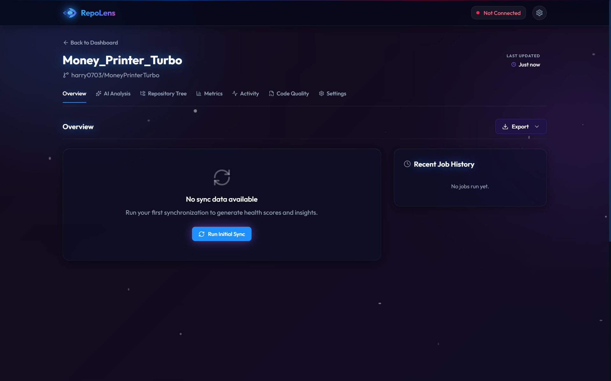 | 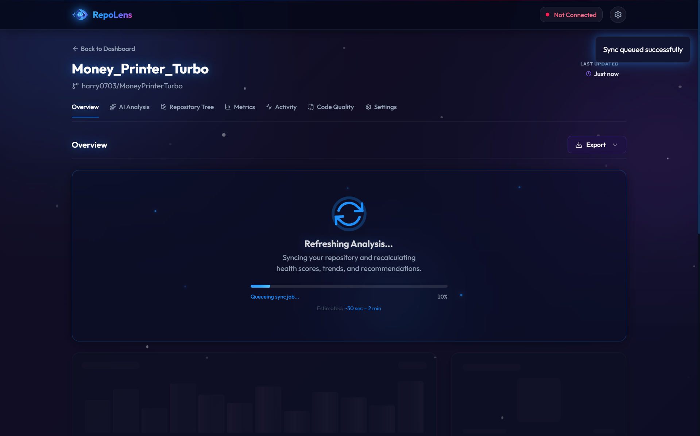 |

| Project Overview & Data | Settings Page |
| :---: | :---: |
| 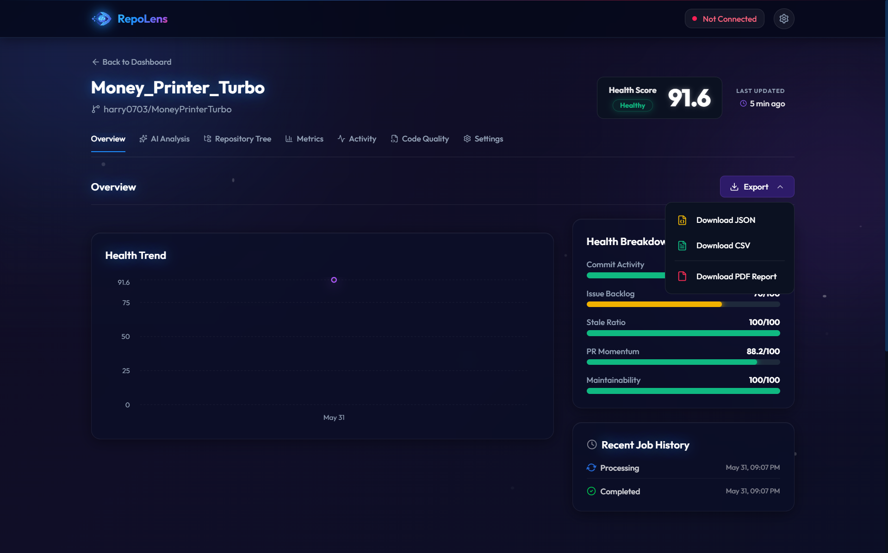 | 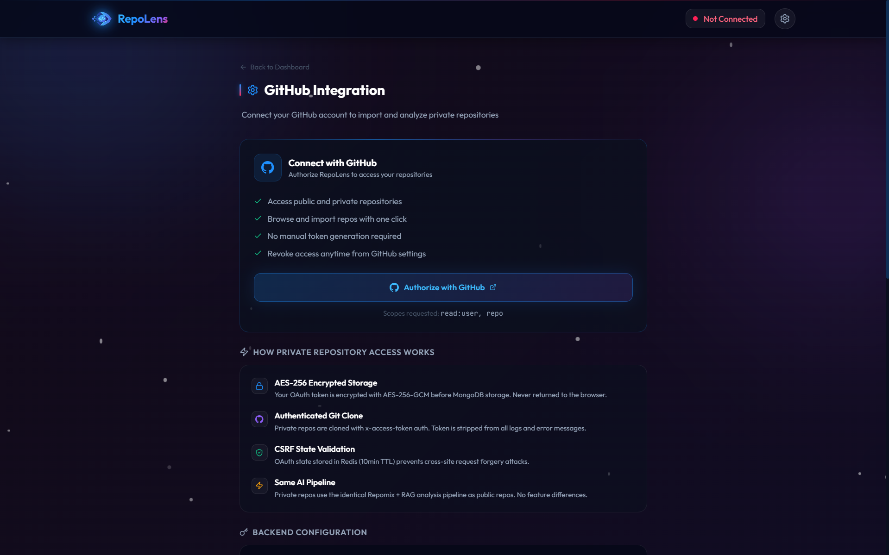 |

---

## 🚀 Installation

### Prerequisites

- [Node.js](https://nodejs.org/) (v18.0.0 or higher)
- [MongoDB](https://www.mongodb.com/)
- [Redis](https://redis.io/)
- [Qdrant](https://qdrant.tech/)

### 1. Clone the repository

```bash
git clone https://github.com/yourusername/RepoLens.git
cd RepoLens
```

### 2. Backend Setup

```bash
cd backend
npm install
```

- Copy `.env.example` to `.env` and fill in your environment variables:
  - **Database & Cache**: `MONGO_URL`, `DB_NAME`, `REDIS_URL`
  - **Auth**: `JWT_SECRET`, `TOKEN_ENCRYPTION_KEY`
  - **Firebase Admin**: `FIREBASE_PROJECT_ID`, `FIREBASE_CLIENT_EMAIL`, `FIREBASE_PRIVATE_KEY`
  - **GitHub OAuth**: `GITHUB_CLIENT_ID`, `GITHUB_CLIENT_SECRET`, `GITHUB_CALLBACK_URL`
  - **AI / LLM**: `GROQ_API_KEY`, `OPENAI_BASE_URL`, `LLM_MODEL`
  - **Vector DB**: `QDRANT_URL`, `QDRANT_API_KEY`
- Initialize the Database:

```bash
npm run db:init
```

- Start the development server:

```bash
npm run dev
```

### 3. Frontend Setup

Open a new terminal window:

```bash
cd frontend
npm install
```

- Copy `.env.example` to `.env` and fill in your environment variables:
  - `VITE_API_URL` (e.g., http://localhost:5000)
  - `VITE_FIREBASE_API_KEY`
  - `VITE_FIREBASE_AUTH_DOMAIN`
- Start the Vite development server:

```bash
npm run dev
```

---

## 🕹️ Usage

1. Open your browser and navigate to `http://localhost:5173` (or the port Vite provides).
2. Login / Register using the Firebase authentication portal.
3. Add a GitHub repository link to begin tracking and scoring.
4. View real-time background processing updates powered by BullMQ and Socket.io.
5. Explore the analytics dashboard and review project snapshots!

---

<div align="center">
  Made with 💖 by <a href="https://github.com/nisargvekariya01">Nisarg Vekariya</a>
</div>
